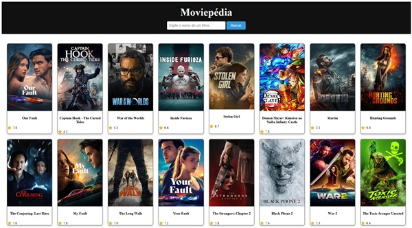

# 🎬 Moviepédia - Seu Guia de Filmes

Este é um projeto de front-end que permite aos usuários descobrir filmes populares e pesquisar por títulos específicos, exibindo detalhes como sinopse e avaliação.

Este projeto foi construído como parte do meu portfólio de desenvolvimento Front-End, com foco na manipulação do DOM e consumo de APIs REST.

---

## 🚀 Demo ao Vivo

Você pode testar o projeto em funcionamento clicando aqui:
**[Moviepédia](https://geisonsile.github.io/moviepedia/)**

---

## 📸 Screenshot



---

## ✨ Funcionalidades (Features)

* **Filmes Populares:** Carrega automaticamente os filmes mais populares do momento ao abrir a página.
* **Busca Dinâmica:** Permite que o usuário pesquise filmes por nome.
* **Detalhes do Filme:** Exibe uma janela (modal) com informações detalhadas (pôster, título, nota e sinopse) ao clicar em um card.
* **Feedback Visual:** Mostra um "spinner" de carregamento (loader) enquanto os dados da API estão sendo buscados.
* **Design Responsivo:** A grade de filmes se adapta a diferentes tamanhos de tela (desktop e mobile).

---

## 🛠️ Tecnologias Utilizadas

Este projeto foi construído utilizando as seguintes tecnologias:

* **HTML5** (com foco em estrutura semântica)
* **CSS3** (utilizando Flexbox, Grid Layout e Animações `@keyframes`)
* **JavaScript (ES6+)** (Vanilla JS, sem frameworks)
* **Fetch API** (para comunicação assíncrona)
* **TheMovieDB (TMDB) API** (como fonte de dados dos filmes)
* **Git & GitHub** (para versionamento)

---

## 🔑 Uma Nota Sobre a API Key

Para este projeto, a chave da API do TheMovieDB (TMDB) está intencionalmente incluída no arquivo `config.js` e exposta no código-fonte do front-end.

**Esta foi uma decisão de arquitetura consciente pelos seguintes motivos:**

1.  **Hospedagem Estática:** O projeto é 100% estático (HTML/CSS/JS) e hospedado no GitHub Pages, que não permite a execução de código back-end para ocultar chaves em variáveis de ambiente.
2.  **Natureza da API:** A API v3 do TMDB é tratada como uma "chave pública". Diferente de APIs de pagamento ou serviços como Google Maps, o TMDB não oferece (no momento) a funcionalidade de "restrição por domínio" (HTTP Referrer).
3.  **Segurança Reativa:** A "proteção" para este tipo de chave é reativa, e não proativa. Em um cenário de abuso (como estouro do *rate limiting*), a chave pode ser instantaneamente regenerada no painel do TMDB e atualizada no repositório.

Em um projeto de produção em larga escala, a abordagem correta seria criar um **servidor proxy (back-end)** que atuaria como intermediário, mantendo a chave de API 100% segura. Para o escopo deste projeto de portfólio, a solução atual é a mais adequada para demonstrar as funcionalidades de front-end.

---

## 📚 O que eu aprendi

* Manipulação avançada do DOM (criar, adicionar e modificar elementos dinamicamente).
* Uso de `async/await` com a `Fetch API` para lidar com requisições assíncronas.
* Tratamento de erros com blocos `try...catch...finally`.
* Técnica de **Delegação de Eventos** (Event Delegation) para adicionar "listeners" em elementos criados dinamicamente (os cards de filme).
* Armazenamento de dados em elementos HTML usando `data-attributes`.
* Criação de um layout em grid responsivo e moderno.

---

## ⚙️ Como rodar o projeto localmente

Como o arquivo `config.js` (contendo a API key) está incluído no repositório para fins de demonstração no GitHub Pages, basta seguir os passos:

1.  Clone este repositório:
    ```bash
    git clone https://github.com/geisonsile/moviepedia.git
    ```
2.  Navegue até o diretório do projeto:
    ```bash
    cd nome-do-repositorio
    ```
3.  Abra o arquivo `index.html` no seu navegador de preferência.

*(Se, por algum motivo, a chave de API no repositório expirar, você pode gerar uma nova no [TheMovieDB](https://www.themoviedb.org/) e substituir o conteúdo da variável `API_KEY` no arquivo `config.js`.)*
